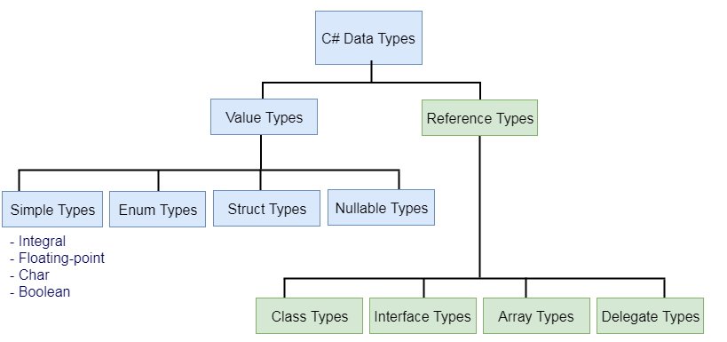

# Diário de Bordo: C#

## Sobre a linguagem
&nbsp;&nbsp;&nbsp;A linguagem de programação C# (leia-se C sharp) foi lançada em 2000 como parte da .NET, uma plataforma de desenvolvimento da Microsoft que fornece uma ampla estrutura para criação e execução de aplicativos. C# é tida como simples, porém extremamente
completa e robusta, o que justifica o fato de atualmente estar entre as [cinco linguagens de programação mais populares](https://www.tiobe.com/tiobe-index/). 

&nbsp;&nbsp;&nbsp; Sendo fortemente tipada e orientada a objetos, ela é extremamente versátil, podendo ser usada para diversos fins, 
seja uma software empresarial ou até mesmo jogos. É uma linguagem mutiplataforma, podendo ser executada em diferentes sistemas operacionais, e tem sua sintaxe similar a de C++, também sofrendo fortes influencias de Java.


## Critérios de avaliação da linguagem
&nbsp;&nbsp;&nbsp; Os princípais cŕiteiros para a avliação de uma línguagem são:

  * **Legibilidade**  
Esse conceito diz respeito a clareza e facilidade da leitura e do entendimento de um código feito em determinada linguagem. C# em particular é tida como extremamente legível. Tem uma sintaxe limpa e organizada, com o uso de de chaves para delimitar bloco de códigos e uma norma de identação difundidade que facilita a padronização, como por exemplo as conveções de uso de CamelCase para noemar classes.  
Ela tem estruturas de controles adequadas, que correspondem a soluções para diferentes problemas, e uma série de tipo de dados primitivos que facilitam a leitura, sendo os principais: **char, byte, short, int, long, float, double, bool, string**


  * **Redigibilidade**  
 Redigibilidade está de certa forma ligada com a legibilidade, pois diz respeito a facilidade de se escrever um código para resolver determinado problema. C#, que é uma linguagem de alto nível, com diversas bibliotecas, tem na redigibilidade um de seus pontos fortes, haja visto que essas suas características facilitam a implementação de um código complexo em poucas lihhas e de forma simples.  

  * **Confiabilidade**  
Um programa é dito confiável caso se comporte de forma esperada em qualquer situação. Nesse quesito, podemos dizer que C# é confiável. Seus tipos de dados são verificados em tempo de compilação, o que reduz a possibilidade de ocorrer um erro. C# também oferece uma robusta estrutura para tratamento de exceções, além disso, devemos ressaltar que é uma linguagem desenvolvida para o .NET, plataforma da Microsoftw, usada com frequência em ambientes Windows, sendo constatemente testada e usada.

  * **Outras características**  
    Se tratando de outras características, temos algumas como custo, portabilidade, generalidade e boa definição:
    * Custo: por ter uma curva de aprendizado razoável, baixos custos de execução e compilação, podemos dizer que é uma linguagem com custo intermediário.
    * Portabilidade: C# conta com diversos frameworks que possibilidader a portabilidade de seus programas, como .NET Framework/Core para desktop, ASP.NET MVC para Web e Xamarim para mobile.
    * Generalidade: Por ser uma linugagem de programação rápido e confiável, encontra espaço para toda sorte de aplicação, sejam games ou software empresariais, C# é capaz de resolver o problema.
    * Boa definição: a Microsoft, [em seu site oficial](https://learn.microsoft.com/pt-br/dotnet/csharp/), disponibiliza a completa documentação para C#.
    


```csharp
using System;

class Program
{
    static void Main()
    {
        Console.WriteLine("Hello, World!");
    }
}

```
&nbsp;&nbsp;&nbsp; Nesse exemplo de código podemos observar o uso das boas práticas de identação em C#, respeitando espaços em brancos, uso adquados de espaçamentos e afins, dessa forma temos nosso "Hello World" de fácil entendimento. Também podemos ter uma noção de como é feita a divisão de um programa em C#.

## Paradigma de C#
&nbsp;&nbsp;&nbsp; Com seu suporte para classes, objetos, encapsulamentos e demais recursos de orientação a objetos, podemos dizer que se trata de uma linguagem OO. Entretanto, a linguagem também disponibiliza suporte a programação funcional, tendo recrusos como lambda, delegado e LINQ, tipicas do paradigma funcional. No código abaixo, podemos observar o uso de classes em C#, recurso do paradigma orientado a objetos.
```csharp
class Animal
{
    public void EmitirSom()
    {
        Console.WriteLine("Animal emitindo som...");
    }
}

// Subclasse que herda da classe Animal
class Cachorro : Animal
{
    public void Latir()
    {
        Console.WriteLine("Cachorro latindo...");
    }
}
```


&nbsp;&nbsp;&nbsp;  Ademais, como a maioria das linguagem de programação modernas, C# segue principalmente o paradigma imperativo, com atribuição de variáveis, iterações, controle de fluxo e etc. Assim sendo, podemos classificar C# como uma lingugagem multiparadigma, afinal, da suporte a diversas categorias de lingugagem.

## Método de implementação
 &nbsp;&nbsp;&nbsp; C# é uma linguagem de programação que opera no ambiente .NET, composto pelo Common Language Runtime (CLR). O CLR, uma implementação da Common Language Infrastructure (CLI), fornece um ambiente de execução para programas .NET. O código-fonte C# é compilado em uma Linguagem Intermediária IL compatível com a CLI, o que permite a portabilidade do código para diferentes plataformas. Essa IL é armazenada em assemblys, que contêm informações sobre tipos, versões e culturas em um manifesto.

&nbsp;&nbsp;&nbsp; Quando um programa C# é executado, o assembly correspondente é carregado no CLR, que realiza a compilação JIT (Just-In-Time), convertendo a linguágem intermediária em instruções nativas da máquina durante a execução. O CLR também oferece serviços como coleta automática de lixo, tratamento de exceções e gerenciamento de recursos. O código que é executado pelo CLR é chamado de "código gerenciado", enquanto o "código não gerenciado" é compilado para uma plataforma específica. Essa arquitetura flexível e eficaz torna C# uma linguagem poderosa para desenvolvimento de software em várias plataformas.


&nbsp;&nbsp;&nbsp; No esquema acima podemos observar como o código é inicialmente compilado numa linguagem intermediária, guardado em assemblys e então executo com execução JIT.


## Variáveis
 &nbsp;&nbsp;&nbsp; Variáveis são uma parte fundamental de qualquer linguagem de programação, e não seria diferente em C#, onde temos alguns tipos de variáveis, como inteiros, ponto flutuanre, caracteres, booleado entre outros. Para usarmos variáveis em C# precisamos primeiro de declará-las, isso da ao compilador o nome e o tipo que será armazenado, veja a seguir um exemplo:


```csharp
int idade;
string nome;
```
  &nbsp;&nbsp;&nbsp; O escopo de variáveis em C# é defino por onde elas são declaradas. Por exemplo, uma variável declarada dentro de um método só é visível dentro desse método, enquanto um atributo declarado dentro da classe apenas, pode ser usado por qualquer método. Além dsso o valor de uma variável pode ser atribuido usando "=", embora também seja possível fazer essa atrubuição no momento da declaração:

 ```csharp
idade = 22;
nome = "Thiago";
DateTime dataNascimento = new DateTime(2000, 08, 26);
```


 &nbsp;&nbsp;&nbsp; Em C#, existem basicamente dois tipos de dados: de valor, que armazenam o próprio valor, e tipos de referência, que armazenam uma referência ao valor. Tipos de valor incluem int, float, enum, enquanto tipos de referência incluem classes, strings e arrays. Essa linguagem também nos permite o casting, que é a conversão de tipo de dados, é possível converter valores de um tipo para outro.
 ```csharp
double valorDouble = 10.5;
int valorInteiro;

valorInteiro = (int)valorDouble; // Realizando o casting.

Console.WriteLine("Valor double: " + valorDouble); // Imprime o 10.5
Console.WriteLine("Valor inteiro (depois do casting): " + valorInteiro); // Imprime a parte inteira após o casting, ou seja, o 10
 ```

## Tipos de dados
 &nbsp;&nbsp;&nbsp; Tipos de dados são um conjunto de regras que ditam quais valores e operações serão realizadas com deterinada variável, um tipo int, por exemplo, diz que o dado ali é um número inteiro e que portanto poderá realizar todas as operações de um número inteiro, embora não possa, por exemplo, ser somado com um tipo string. Como já citamos anteriormente, C# é fortemente tipada, o que significa que você precisa declarar os tipos de variáveis, no geral terá que converter explicitamente e os tipos de dados são verificados em tempo de compilação. 


 &nbsp;&nbsp;&nbsp; Existem basicamente dois tipos de dados, os primitivos e os estruturais. Os primitivos são aqueles que dão origens aos estruturais, por exemplo, uma string, que é estrutural, é uma coleção de char, que por sua vez é um tipo primitivo. Abaixo temos uma tabela que lista os tipos primitivos de C# (também tidos como "Simple Types"), a partir deles temos diversos outros tipos.


 &nbsp;&nbsp;&nbsp; C# também divide seus dados entre de valor e de referência, como já citamos no tópico anterior, que armazenam  respectivamente o próprio valor ou que armazenam uma referência ao valor. Os tipos de valor inclues, além dos primitivos que já citamos, enumerações, structs e nulos. Os tipos de referência são classes, interfaces e arrays. A seguir um esquema que ilustra essa divisão. 




 &nbsp;&nbsp;&nbsp; Devemos mencionar também que embora C# permita operação com ponteiros, elas não são recomendadas e são mais restritas em relação as linguagens de mais baixo nível como C, além de marcar o uso de ponteiro como "não seguro".


## Expressões e atribuição

 &nbsp;&nbsp;&nbsp; Expressões aritméticas em C# incluem adição, subtração, multiplicação, divisão e etc. Para manipular tais expressões usamos os próprios operadores aritméticos. Embora a ordem de precedência seja parecida com a da matemática que vemos no dia dia, no caso de elemento de mesma prioridade o código é executado da esquerda para a direita. Também podemos usar parênteses para alterar essa ordem, fazendo com que, por exemplo, uma soma ocorra antes de uma multiplicação numa expressão. No exemplo de código abaixo, vêmos algumas operações e o uso de parênteses apra realizarmos uma soma antes de uma multiplicação.
```csharp
int x = 10;
int y = 5;

int soma = x + y;       // Adição
int subtracao = x - y;  // Subtração
int multiplicacao = x * y;  // Multiplicação
int divisao = x / y;    // Divisão

int resultado = (x + y) * (x - y);  // Expressão mais complexa
```

 &nbsp;&nbsp;&nbsp; Também podemos fazer uso de expressões condicionais para atribuir valores. Em C# também é possível fazer uso de uma expressão condicional ternária.
 ```csharp
int idade = 18;

if (idade >= 18)
{
    Console.WriteLine("Você é maior de idade.");
}
else
{
    Console.WriteLine("Você é menor de idade.");
}

// Expressão condicional ternária
string status = (idade >= 18) ? "Maior de idade" : "Menor de idade";
Console.WriteLine(status);
```

## Estruturas de Controle
 &nbsp;&nbsp;&nbsp; Em C#, as estruturas de controle são usadas para controlar o fluxo de execução do programa. Elas permitem que você tome decisões, execute repetições e execute diferentes blocos de código com base em condições específicas. A primeira estrutura que citarems é a condicional if - if else - else, a qual utilizamos para executar determinada tomada de decisão.
 
 ```csharp
int idade = 18;
if (idade < 18)
{
    Console.WriteLine("Você é menor de idade.");
}
else if (idade == 18)
{
    Console.WriteLine("Você tem 18 anos.");
}
else
{
    Console.WriteLine("Você é maior de idade.");
}
```

 &nbsp;&nbsp;&nbsp; Também contamos com seletores múltiplos usando a operação switch. 

 
 ```csharp
 char nota = 'B';

switch (nota)
{
    case 'A':
        Console.WriteLine("Excelente!");
        break;
    case 'B':
        Console.WriteLine("Bom trabalho.");
        break;
    case 'C':
        Console.WriteLine("Médio.");
        break;
    case 'D':
        Console.WriteLine("Precisa melhorar.");
        break;
    case 'E':
        Console.WriteLine("Insatisfatório.");
        break;
    default:
        Console.WriteLine("Nota inválida.");
        break;
}
```

&nbsp;&nbsp;&nbsp; Ademais, C# também possui estruturas de loops, podendo essas serem controladas por contadores, logicamente, pelo usuário e sobre estruturas.

 * **Por contadores**  

Nesse caso, as iterações são feitas por um contadores, e a utilizamos quando temos um número específico de casos de repetições que já nos foi fornecido. Utilizando uma estrutura genêrica: for (count = 1; count < 10; count ++).

 * **Logicamente**  

São mais gerais que loops controlados por contadores, são controlados por uma expressão booleana, como por exemplo, **while(queue != null)** ou seja, enquanto houver um elemento na fila, o loop sera executado.

 * **Pelo usuário**  

Permite ao usuário gerir a saída do loop com uma condicional e um break, ou seja, o usuário influencia no fluxo de execução do loop.

 * **Sobre estruturas**
     
  Refere-se à capacidade de percorrer (iterar) uma estrutura de dados, como um array ou uma coleção, para acessar e manipular seus elementos. O foreach é frequentemente usado para iterar sobre coleções em C#. Noexemplo abaixo o array é todo percorrido e impresso.
```csharp
int[] numeros = { 1, 2, 3, 4, 5 };
foreach (int numero in numeros)
{
    Console.WriteLine(numero);
}
```

## Subprogramas 

  &nbsp;&nbsp;&nbsp; Subprogramas são blocos de código que realizam tarefas específicas e podem ser chamados de dentro de outros blocos de código. Eles são uma parte essencial da programação e da organização do código. Em C#, você pode criar subprogramas de duas maneiras principais: métodos e funções.  
  
  &nbsp;&nbsp;&nbsp; Nos métodos realizamos uma ação ou uma série de ações, eles podem ou não retornar um valor. Já as funções são semelhantes aos métodos, mas elas retornam um valor. Também temos os tipos de passagem de dados (ou parâmetos), que podem ser por valor ou referência, respectivamente, passando uma cópia do valor ou o endereço original da memória.

  
  &nbsp;&nbsp;&nbsp; Ainda em subprogramas, tempos os conceitos de variáveis locais e funções locais. Essas, como o nome sugere, são de escopo local, sendo declaradas dentro da função / método, e portanto só podem ser acessadas de dentro desses subprogramas em que foram declaradas. 

```csharp
 void MeuProcedimento()
{
    int x = 10; // Declaração de variável local, somente podendo ser acessada nesse método.

    int FuncaoLocal() // Função local que só pode ser accessada de dentro dessa função.
    {
        return x * 2; // 
    }

    int resultado = FuncaoLocal();
    Console.WriteLine(resultado);
}
```
  &nbsp;&nbsp;&nbsp; Em C# podemos usar os modificadores in, out e ref para passar parâmetros para métodos ou funções com diferentes comportamentos.  
 **In:** O parâmetro é passado como somente leitura.  
 **Out:** O parâmetro é passado como somente escrita.  
 **Ref:** O parâmetro é passado como leitura e escrita.  
 
```csharp
void RetornaMaisDeUmValor(in x, out int a, out int b)
{
    //x = 2; resultaria em erro, pois é somente leitura.
    a = 5;
    b = 10;
}
```

  &nbsp;&nbsp;&nbsp; Em C# você também pode passar métodos ou funções como parâmetros para outros métodos. Isso é comumente usado em cenários de programação funcional e é conhecido como delegates ou expressões lambda.

## Tratamento de exceção
 &nbsp;&nbsp;&nbsp; C# também permite tratamento de exceção, que é uma ferramente usada por programadores para capturar e lidar com erros que possam vir a acontecer durante a execução do programa. Para tanto, é usado um bloco try, onde colocamos nosso programa que pode vir a gerar uma exceção, então os blocos catch que tratam exceções definias, finalmente temos um bloco finally que contém um código que será executado independentemente de uma exceção ser ou não lançada.


```csharp
try
{
    // Código que possa gerar exceções vai aqui.
}
catch (Alguma erro que pode ser gerado)
{
    // Código para lidar com a exceção vai aqui.
}
finally
{
    // Código para ser executado depois dos blocos de try (e possivelmente cathc) vai aqui
}
```


