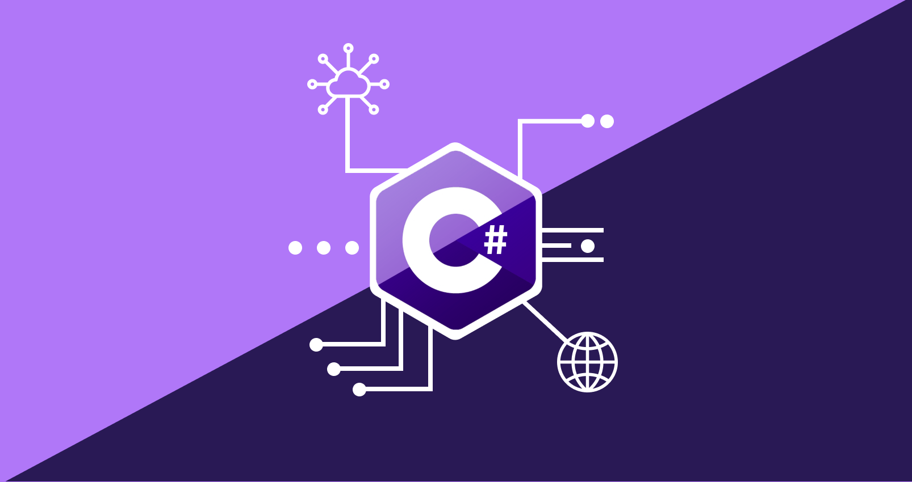

# Diário de Bordo: C#

## Sobre a linguagem
&nbsp;&nbsp;&nbsp;A linguagem de programação C# (leia-se C sharp) foi lançada em 2000 como parte da .NET, uma plataforma de desenvolvimento da Microsoft que fornece uma ampla estrutura para criação e execução de aplicativos. C# é tida como simples, porém extremamente
completa e robusta, o que justifica o fato de atualmente estar entre as [cinco linguagens de programação mais populares](https://www.tiobe.com/tiobe-index/). 

&nbsp;&nbsp;&nbsp; Sendo fortemente tipada e orientada a objetos, ela é extremamente versátil, podendo ser usada para diversos fins, 
seja uma software empresarial ou até mesmo jogos. É uma linguagem mutiplataforma, podendo ser executada em diferentes sistemas operacionais, e tem sua sintaxe similar a de C++, também sofrendo fortes influencias de Java.


## Critérios de avaliação da linguagem
&nbsp;&nbsp;&nbsp; Os princípais cŕiteiros para a avliação de uma línguagem são:

  * **Legibilidade**  
Esse conceito diz respeito a clareza e facilidade da leitura e do entendimento de um código feito em determinada linguagem. C# em particular é tida como extremamente legível. Tem uma sintaxe limpa e organizada, com o uso de de chaves para delimitar bloco de códigos e uma norma de identação difundidade que facilita a padronização, como por exemplo as conveções de uso de CamelCase para noemar classes.  
Ela tem estruturas de controles adequadas, que correspondem a soluções para diferentes problemas, e uma série de tipo de dados primitivos que facilitam a leitura, sendo os principais: **char, byte, short, int, long, float, double, bool, string**


  * **Redigibilidade**  
 Redigibilidade está de certa forma ligada com a legibilidade, pois diz respeito a facilidade de se escrever um código para resolver determinado problema. C#, que é uma linguagem de alto nível, com diversas bibliotecas, tem na redigibilidade um de seus pontos fortes, haja visto que essas suas características facilitam a implementação de um código complexo em poucas lihhas e de forma simples.  

  * **Confiabilidade**  
Um programa é dito confiável caso se comporte de forma esperada em qualquer situação. Nesse quesito, podemos dizer que C# é confiável. Seus tipos de dados são verificados em tempo de compilação, o que reduz a possibilidade de ocorrer um erro. C# também oferece uma robusta estrutura para tratamento de exceções, além disso, devemos ressaltar que é uma linguagem desenvolvida para o .NET, plataforma da Microsoftw, usada com frequência em ambientes Windows, sendo constatemente testada e usada.

  * **Outras características**  
    Se tratando de outras características, temos algumas como custo, portabilidade, generalidade e boa definição:
    * Custo: por ter uma curva de aprendizado razoável, baixos custos de execução e compilação, podemos dizer que é uma linguagem com custo intermediário.
    * Portabilidade: C# conta com diversos frameworks que possibilidader a portabilidade de seus programas, como .NET Framework/Core para desktop, ASP.NET MVC para Web e Xamarim para mobile.
    * Generalidade: Por ser uma linugagem de programação rápido e confiável, encontra espaço para toda sorte de aplicação, sejam games ou software empresariais, C# é capaz de resolver o problema.
    * Boa definição: a Microsoft, [em seu site oficial](https://learn.microsoft.com/pt-br/dotnet/csharp/), disponibiliza a completa documentação para C#.
    


```csharp
using System;

class Program
{
    static void Main()
    {
        Console.WriteLine("Hello, World!");
    }
}

```
&nbsp;&nbsp;&nbsp; Nesse exemplo de código podemos observar o uso das boas práticas de identação em C#, respeitando espaços em brancos, uso adquados de espaçamentos e afins, dessa forma temos nosso "Hello World" de fácil entendimento. Também podemos ter uma noção de como é feita a divisão de um programa em C#.

## Paradigma de C#
&nbsp;&nbsp;&nbsp; Com seu suporte para classes, objetos, encapsulamentos e demais recursos de orientação a objetos, podemos dizer que se trata de uma linguagem OO. Entretanto, a linguagem também disponibiliza suporte a programação funcional, tendo recrusos como lambda, delegado e LINQ, tipicas do paradigma funcional. No código abaixo, podemos observar o uso de classes em C#, recurso do paradigma orientado a objetos.
```csharp
class Animal
{
    public void EmitirSom()
    {
        Console.WriteLine("Animal emitindo som...");
    }
}

// Subclasse que herda da classe Animal
class Cachorro : Animal
{
    public void Latir()
    {
        Console.WriteLine("Cachorro latindo...");
    }
}
```


&nbsp;&nbsp;&nbsp;  Ademais, como a maioria das linguagem de programação modernas, C# segue principalmente o paradigma imperativo, com atribuição de variáveis, iterações, controle de fluxo e etc. Assim sendo, podemos classificar C# como uma lingugagem multiparadigma, afinal, da suporte a diversas categorias de lingugagem.

## Método de implementação
 &nbsp;&nbsp;&nbsp; C# é uma linguagem de programação que opera no ambiente .NET, composto pelo Common Language Runtime (CLR). O CLR, uma implementação da Common Language Infrastructure (CLI), fornece um ambiente de execução para programas .NET. O código-fonte C# é compilado em uma Linguagem Intermediária IL compatível com a CLI, o que permite a portabilidade do código para diferentes plataformas. Essa IL é armazenada em assemblys, que contêm informações sobre tipos, versões e culturas em um manifesto.

&nbsp;&nbsp;&nbsp; Quando um programa C# é executado, o assembly correspondente é carregado no CLR, que realiza a compilação JIT (Just-In-Time), convertendo a linguágem intermediária em instruções nativas da máquina durante a execução. O CLR também oferece serviços como coleta automática de lixo, tratamento de exceções e gerenciamento de recursos. O código que é executado pelo CLR é chamado de "código gerenciado", enquanto o "código não gerenciado" é compilado para uma plataforma específica. Essa arquitetura flexível e eficaz torna C# uma linguagem poderosa para desenvolvimento de software em várias plataformas.


&nbsp;&nbsp;&nbsp; No esquema acima podemos observar como o código é inicialmente compilado numa linguagem intermediária, guardado em assemblys e então executo com execução JIT.


## Variáveis
 &nbsp;&nbsp;&nbsp; Variáveis são uma parte fundamental de qualquer linguagem de programação, e não seria diferente em C#, onde temos alguns tipos de variáveis, como inteiros, ponto flutuanre, caracteres, booleado entre outros. Para usarmos variáveis em C# precisamos primeiro de declará-las, isso da ao compilador o nome e o tipo que será armazenado, veja a seguir um exemplo:


```csharp
int idade;
string nome;
```
  &nbsp;&nbsp;&nbsp; O escopo de variáveis em C# é defino por onde elas são declaradas. Por exemplo, uma variável declarada dentro de um método só é visível dentro desse método, enquanto um atributo declarado dentro da classe apenas, pode ser usado por qualquer método. Além dsso o valor de uma variável pode ser atribuido usando "=", embora também seja possível fazer essa atrubuição no momento da declaração:

 ```csharp
idade = 22;
nome = "Thiago";
DateTime dataNascimento = new DateTime(2000, 08, 26);
```


 &nbsp;&nbsp;&nbsp; Em C#, existem basicamente dois tipos de dados: de valor, que armazenam o próprio valor, e tipos de referência, que armazenam uma referência ao valor. Tipos de valor incluem int, float, enum, enquanto tipos de referência incluem classes, strings e arrays. Essa linguagem também nos permite o casting, que é a conversão de tipo de dados, é possível converter valores de um tipo para outro.
 ```csharp
double valorDouble = 10.5;
int valorInteiro;

valorInteiro = (int)valorDouble; // Realizando o casting.

Console.WriteLine("Valor double: " + valorDouble); // Imprime o 10.5
Console.WriteLine("Valor inteiro (depois do casting): " + valorInteiro); // Imprime a parte inteira após o casting, ou seja, o 10
 ```

## Tipos de dados
 &nbsp;&nbsp;&nbsp; Tipos de dados são um conjunto de regras que ditam quais valores e operações serão realizadas com deterinada variável, um tipo int, por exemplo, diz que o dado ali é um número inteiro e que portanto poderá realizar todas as operações de um número inteiro, embora não possa, por exemplo, ser somado com um tipo string. Como já citamos anteriormente, C# é fortemente tipada, o que significa que você precisa declarar os tipos de variáveis, no geral terá que converter explicitamente e os tipos de dados são verificados em tempo de compilação. 


 &nbsp;&nbsp;&nbsp; Existem basicamente dois tipos de dados, os primitivos e os estruturais. Os primitivos são aqueles que dão origens aos estruturais, por exemplo, uma string, que é estrutural, é uma coleção de char, que por sua vez é um tipo primitivo.


